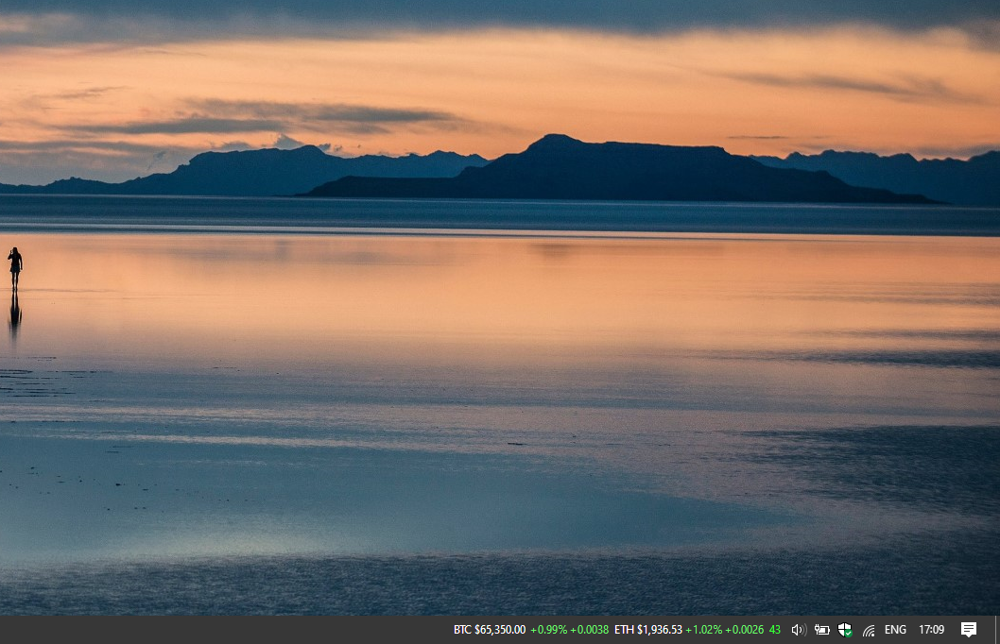

# Crypto-Price-Ticker-v1.1.1-Taskbar-Widget


This Windows 10/11 (21H2) taskbar widget provides real-time cryptocurrency price tracking, featuring customizable pairs for live monitoring. It operates as a lightweight system tray application, allowing for immediate asset rate visibility without browser usage.

## Features

* Real-time BTC and selected cryptocurrency prices
* 24h price change
* Funding rates:

  * Current
  * Time-weighted
  * 24h cumulative
* Fear & Greed Index
* Multiple market data providers:

  * Binance Futures
  * Bybit Linear Perpetual
  * OKX Perpetual Swap
* Configurable update frequency: **2s / 20s / 2min**
* Custom cryptocurrency pairs via `PairsList.cfg`
* Persistent settings via Windows Registry
* Background data fetching with WinHTTP
* Color-coded price changes and funding rates
* Fear & Greed extreme-value blinking indicator
* Lightweight native C++ / Win32 implementation

## Requirements

* Windows
* Visual Studio with C++ desktop development tools
* Windows SDK
* C++17 or later
  
## Configuration
Create `PairsList.cfg` next to the widget DLL:
```text
BTC=BTCUSDT,BTCUSDT,BTC-USDT-SWAP
ETH=ETHUSDT,ETHUSDT,ETH-USDT-SWAP
SOL=SOLUSDT,SOLUSDT,SOL-USDT-SWAP
```
Format:
```text
LABEL=BinanceSymbol,BybitSymbol,OKXSymbol
```
### Fear & Greed Index API Key

The **Fear & Greed Index requires an individual CoinMarketCap API key**.
Each user must obtain and configure their own API key. The key is required to request the Fear & Greed Index from the CoinMarketCap API.
Without a valid API key, the Fear & Greed Index will not be available.

## Data Sources
Market data is retrieved from Binance, Bybit, and OKX APIs. The Fear & Greed Index is retrieved from the CoinMarketCap API and requires a personal API key.

## Build
Open the project in Visual Studio, build the DLL, and register/install the COM DeskBand according to the project's registration setup.
After installation, the widget can be added to the Windows taskbar as a DeskBand.

## Screenshot


## Version
**v1.1.1 Release**
